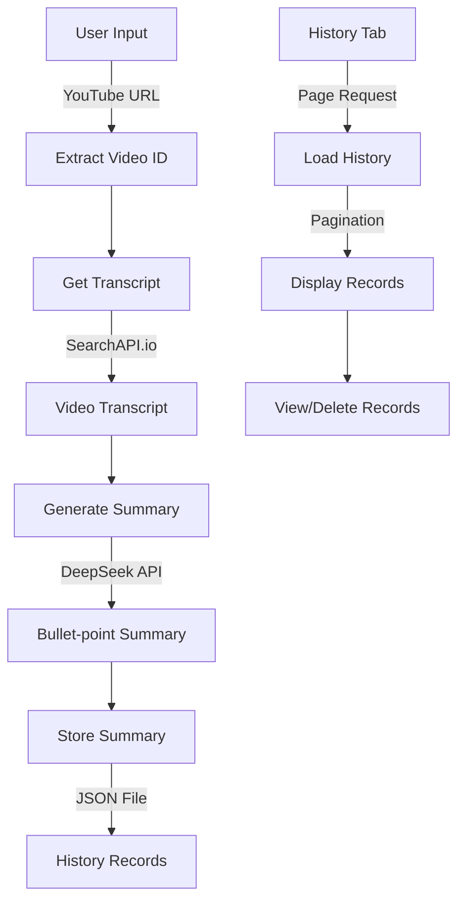
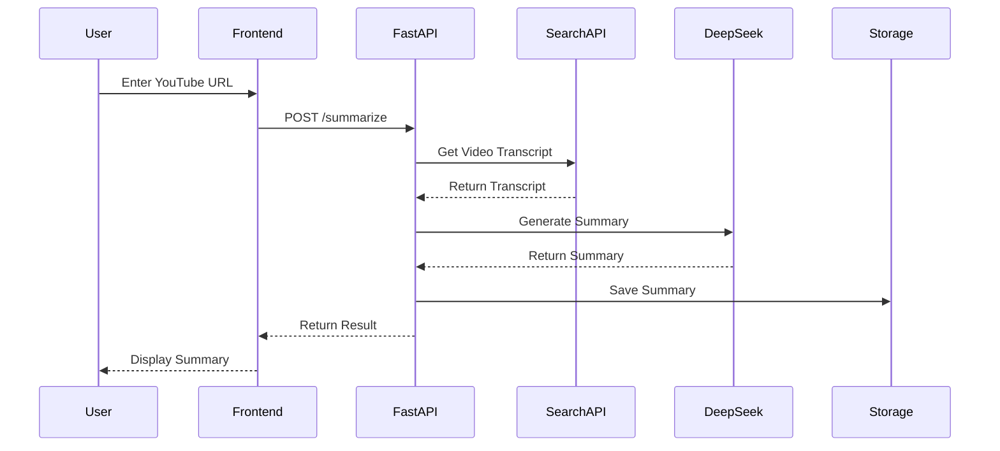

# YouTube Video Summarizer

A FastAPI application that transforms YouTube videos into bullet point summaries using AI. This tool extracts video transcripts and generates concise summaries with the DeepSeek-R1 model.

Current Version: 0.2 ([View Version History](version_history.md) | [Version History (English)](version_history_en.md))

## Architecture

### Code Structure
```
yt-sum-fastapi-vercel/
├── main.py              # FastAPI application entry point
├── static/             # Static files directory
│   └── style.css       # Custom CSS styles
├── templates/          # HTML templates
│   └── index.html      # Main page template
├── requirements.txt    # Python dependencies
└── vercel.json        # Vercel deployment configuration
```

### Project Flow


### API Endpoints
```mermaid
graph LR
    A[FastAPI Server] --> B[GET /]
    A --> C[POST /summarize]
    A --> D[GET /history]
    A --> E[GET /api/history]
    A --> F[DELETE /api/history/{id}]
    A --> G[GET /api/summary/{id}]
    
    B -->|"返回首页"| H[index.html]
    C -->|"生成总结"| I[Summary Result]
    D -->|"历史页面"| J[History Page]
    E -->|"分页数据"| K[JSON Response]
    F -->|"删除记录"| L[Status Response]
    G -->|"获取详情"| M[Summary Detail]
```

### Technical Flow


## Features

- Extract YouTube video transcripts using SearchAPI.io
- Generate bullet-point summaries with DeepSeek AI
- Save summaries to local files
- View history of previously generated summaries
- Clean, responsive UI with Bootstrap

## Setup

### Prerequisites

- Python 3.8 or higher
- DeepSeek API key (https://platform.deepseek.ai/)
- SearchAPI.io API key (https://www.searchapi.io/)

### Installation

1. Clone the repository:
   ```
   git clone https://github.com/yourusername/yt-sum-fastapi-vercel.git
   cd yt-sum-fastapi-vercel
   ```

2. Install dependencies:
   ```
   pip install -r requirements.txt
   ```

3. Run the application locally:
   ```
   uvicorn main:app --reload
   ```

4. Open your browser and navigate to `http://localhost:8000`

## Usage

1. Enter a YouTube video URL in the input field
2. Provide your DeepSeek API key and SearchAPI.io API key
3. Click "Start Summary" to generate a bullet-point summary
4. View the summary and save it locally if desired
5. Access your summary history in the "History" tab

## Deployment to Vercel

1. Install Vercel CLI:
   ```
   npm install -g vercel
   ```

2. Create a `vercel.json` file in the project root with the following content:
   ```json
   {
     "version": 2,
     "builds": [
       {
         "src": "main.py",
         "use": "@vercel/python"
       }
     ],
     "routes": [
       {
         "src": "/(.*)",
         "dest": "main.py"
       }
     ]
   }
   ```

3. Deploy to Vercel:
   ```
   vercel
   ```
